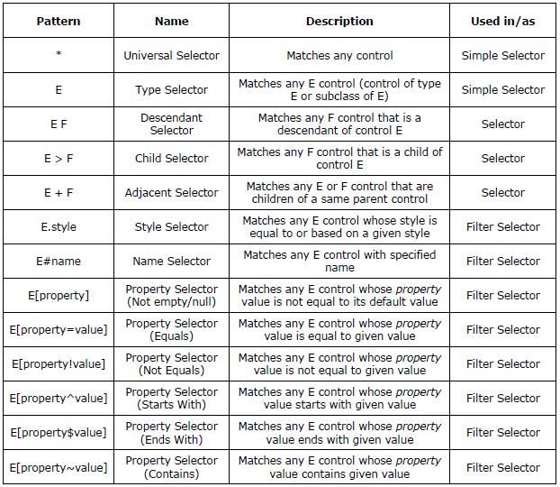

# What is XamlQuery

XamlQuery is a lightweight yet powerful library that enables rapid development using XAML (WPF Xamarin or Silverlight). It simplifies finding controls by name, type, style, property value or position. It also helps in event handling, animating the controls and much more. In short, what XamlQuery aims to do to XAML is similar to what jQuery does to JavaScript.

XamlQuery provides two approaches for finding controls.
- Using Selector Queries, and
- Using Managed Helper Methods

# Using Selector Queries

XamlQuery selectors are feature-rich and similar to CSS (cascading style sheet) selectors and jQuery selectors. A selector is a string that contains a set of matching rules or conditions that determine which controls to extract from the rendered output. The following table summarizes the syntax of selectors.



For more information about Selectors syntax and examples, see http://www.codeding.com/XamlQuery/?topic=15

Once the CSS-like syntax is understood, the selectors are very easy and intuitive to find controls. The lookup is performed in child/descendant controls of a given reference control. The reference control limits the search scope. It would be optimal to search in a lesser scope for faster results.

The following method is used to find controls using selectors.

`Search()` method accepts a reference control and a selector query-string and returns the matching controls. The reference control is the one where the search starts.

# Selector Examples

Find all Rectangle elements inside a canvas.

      #MainCanvas Rectangle

Finds all Shape elements including its subclasses (Rectangle, Line, Ellipse, etc.) inside a canvas.

      #MainCanvas Shape

Find all textboxes inside a ScrollViewer that are not direct children of that ScrollViewer. The ‘*’ indicates that a ScrollViewer must be the ancestor of 'some control' which in turn is ancestor of a TextBox.

      ScrollViewer * TextBox

Get all grids that are immediate children of all StackPanels.

      StackPanel > Grid

Get all children of a WrapPanel named ‘ScoresContainer’.

      WrapPanel#ScoresContainer > *

Fnd all Ellipses with style HighlightedNode.

      #LayoutRoot Ellipse.HighlightedNode

Find the control named EmailTextBox that is a descendant of RegisterGrid.

      #RegisterGrid #EmailTextBox

Get all TextBoxes whose Tag property is set.

      TextBox[Tag]

Get all TextBlocks in second column of a grid.

      #SalesReportGrid TextBlock[Grid_Column=1]

Find all controls whose name starts with 'Rect'

      *[Name^Rect]

# Using Managed Helper Methods

The following are helper methods that are used to find children and parent controls.

`All()` - finds all children of a given control.

`ByType()` - finds all children of specified type, for example TextBox, Rectangle, etc.

`ByProperty()` - finds children whose property value matches a specified criteria. The FilterType optional parameter controls the matching of property value. The possible values for FilterType are Equal, NotEqual, StartsWith, EndsWith and Contains. The string representation of the property value is used for StartsWith, EndsWith and Contains filter-types.

`AllParents()` - finds all parents (upto root) of a control.

`ParentsUpto()` - finds all parents, until the parent with specified type or name is found.

`ParentByType()` - finds the first parent of specified type.

`ParentsByType()` - finds all parents of specified type.

`ParentByName()` - finds a parent control by name.

`Root()` - method finds the root control of the screen or window or page. If a UserControl or Page is embedded within another UserControl or Page, the later will be returned as root.

# XamlQuery API

The **ControlSet** is a set of dependency objects. All the methods of XamlQuery returns ControlSet object. The ControlSet provides several methods/functions for carrying out useful tasks related to the controls. Each method operates on all the controls in the ControlSet. Most of the methods of ControlSet simplifies a complex task and can be invoked in a single line.

## Filter Methods

These methods reduce the set of matched controls to those that pass a criteria (defined by the method).

`FilterByType()` - finds and returns controls of specified type.

`FilterByTypes()` - finds and returns controls of specified types.

`FilterByProperty()` - finds and returns controls whose property value matches a specified criteria.

`RemoveByType()` - removes controls of specified type.

`RemoveByTypes()` - removes controls of specified types.

`Not()` - removes the given list of controls.

`Even()` - returns controls at even indices.

`Odd()` - returns controls at odd indices.

`Gt()` - returns controls at index greater than specified index.

`Lt()` - returns controls at index lesser than specified index.

`Enabled()` - returns all enabled controls.

`Disabled()` - returns all disabled controls.

`Visible()` - returns all visible controls.

`Invisible()` - returns all invisible controls.

`Checked()` - returns all checked controls.

`Unchecked()` - returns all unchecked controls.

## Value-Related Methods

These methods operate on property values.

`SetValue()` - sets the value of specified property (of all controls) to a given value.

`GetValue()` - returns the value of specified property (of all controls) as List object.

`SetBinding()` - attaches a binding to specified property (of all controls).

`ClearValue()` - clears the local value of a specified property (of all controls).

`Val()` - returns the current value of first control.

`Data()` - gets or sets an arbitrary object to all controls (similar to multiple Tag properties).

## Visibility-Related Methods

These methods are used to hide/show controls, with optional animation. The speed of animation and the opacity can be specified through arguments.

`Hide()` - hides all controls.

`Show()` - displays all controls.

`Toggle()` - alternates the visibility of controls.

`FadeOut()` - hides the controls by fading them to transparent.

`FadeIn()` - displays the controls by fading them to opaque.

`FadeTo()` - sets the opacity of controls to a specified value.

`FadeToggle()` - alternates the transparency of controls.

`SlideUp()` - hides the controls with a sliding motion.

`SlideDown()` - displays the controls with a sliding motion.

`SlideTo()` - sets the height of controls to a specified value.

`SlideToggle()` - displays or hides the controls with a sliding motion.

## Animation Methods

These methods are used to carry out a custom animation on a given property.

`Animate()` - animates the controls on a given property and settings (like duration, begin/end values, etc.)

## Event-Related Methods

These methods simplifies the tasks related to event-handling. The events can be specified by high-level event names, defined by EventType enumeration. For more information, see XamlQuery project page.

`AddHandler()` - attaches an event handler to specified event of all controls.

`RemoveHandler()` - removes the specified event from all controls.

`Bind()` - attaches an event handler to event specified by a high level name. Events attached using Bind() can be fired manually.

`Trigger()` - fires/invokes the event handler of specified event manually (without actual event occurs).

## Layout-Related Methods

These methods operate on layout attributes like position, size, etc.

`Detach()` - deletes/removes all controls from the rendered output.

`DetachByType()` - deletes/removes controls of given type from the rendered output.

`DetachByTypes()` - deletes/removes controls of given types from the rendered output.

`Empty()` - removes all controls from a container control (like Panel, Grid, etc.)

`Width()` - returns the actual width of first control.

`Height()` - returns the actual height of first control.

`Position()` - returns the position of first control, with reference to its immediate parent.

# API Examples

The following code applies some styles to all rectangles inside a canvas.
```
ControlSet allRectangles = XamlQuery.Search(LayoutRoot, "#MainCanvas Rectangle");
allRectangles.SetValue(Shape.StrokeThicknessProperty, 4.0);
allRectangles.SetValue(Shape.FillProperty, new SolidColorBrush(Colors.LightGray));
```
The following code disables all textboxes inside the registration form.
```
XamlQuery.Search(RegisterGrid, "TextBox").SetValue(Control.IsEnabledProperty, false);
```
The following code attaches mouse-enter event to all text-blocks in a grid.
```
ControlSet allTextBlocks = XamlQuery.Search(LayoutRoot, "#RegisterGrid TextBlock");
allTextBlocks.Bind(EventType.MouseEnter,
    new MouseEventHandler(delegate(object sender, MouseEventArgs e)
{
    ((TextBlock)sender).FontWeight = FontWeights.Bold;
}));
```
The following code gets all textboxes that are marked as compulsory.
```
XamlQuery.Search(LayoutRoot, "TextBox[FrameworkElement_Tag=Compulsory]");
```
# Frequently Asked Questions (FAQ)

1) Why Search() method requires a reference control as argument?

The reference control is used to limit the search scope. It would be optimal to search in a lesser scope for faster results. The lesser the search scope, the higher the accuracy of matching. For example, if the user needs to find controls inside a Grid, the reference control shall be that Grid instead of root control in the Page/UserControl.

2) Can we use any number of white-spaces inside a query string?

Yes, there is no restriction in number of white-spaces in a selector. Also, a selector can span to multiple lines. However, the location of white-space between two simple-selectors is significant because white-space is a symbol for descendant-selector if used between two simple-selectors.

3) Is "*.GreenRect" and "* .GreenRect" are different?

Yes, white-space is a symbol used for descendant selectors. ‘*.GreenRect’ will match all controls with style ‘GreenRect’. ‘* .GreenRect’ will match all controls with style ‘GreenRect’ that are descendants of some other control in the rendered output.

4) Should dependency property names end with 'Property'?

No, the ‘Property’ keyword should be ignored while using a dependency property in a selector. For example, UIElement.OpacityProperty should be given as ‘UIElement_Opacity’.

5) While using style selectors, styles should be defined in the same UserControl/Page?

No, styles can reside in same UserControl/Page or any of merged resource dictionaries or App.xaml also. XamlQuery will search for styles in all these places.

6) While using style selectors, using a base style will match controls of its dependent styles?

Yes, using a base style in selector will match controls whose style is extended from that base-style. For example, if style ‘GreenRect’ and ‘BlueRect’ are based on style ‘BaseRect’, then the selector query ‘*.BaseRect’ will match both green and blue rectangles.

7) Is type selectors can be used to find subclasses of a control type?

Yes, type-selectors match controls of sub classes also. For example, the selector query ‘Shape’ will match controls of type Rectangle, Line, Ellipse, etc. Similarly, the selector query ‘Selector’ will match controls of type ComboBox, ListBox, etc.

8) Double spaces between two simple-selectors means double descendant-selectors?

No, multiple-spaces (including line-breaks) are considered as single white-space. However, if you need to apply double descendant-selectors, you can use '*' like this "#MainCanvas * Rectangle".
